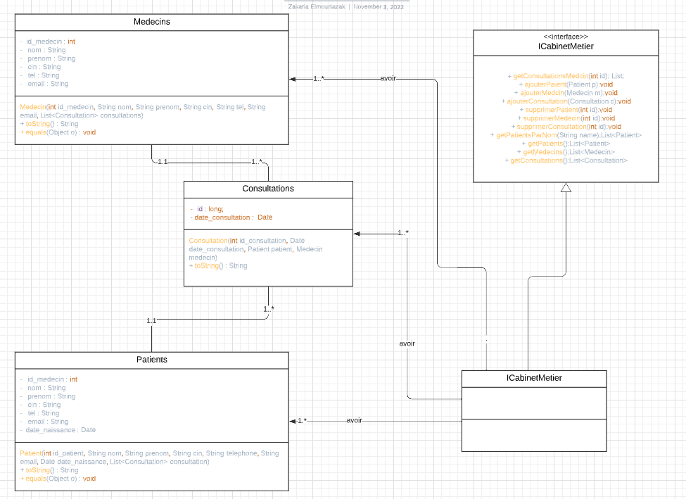
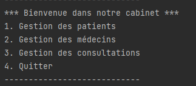
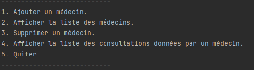
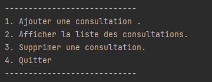

## Gestion des commandes

> Un cabinet médical est un lieu où sont réalisées de >nombreuses consultations sous la 
>responsabilité des cadres médicaux, qui interprètent les résultats dans le but de participer au 
>diagnostic et au suivi de certaines maladies. Dans ce cadre, on souhaite créer une application Java 
>afin de gérer les consultations dans un cabinet médical.

## Les Fonctions principaux de l'application

### Gestion des patientes

- [x] la creation d'un nouveau cilent 
- [x] Afficher la liste des patients
- [x] Rechercher des patients par mot Clé.
- [x] Ajouter un patient.
- [x] Supprimer un patient.
- [x] Afficher la liste des consultations d’un patient.

### Gestion des medecins

- [x] Ajouter un médecin.
- [x] Afficher la liste des médecins.
- [x] Supprimer un médecin.
- [x] Afficher la liste des consultations données par un médecin

### Gestion des consultations

- [x] Ajouter une consultation (il faut affecter un patient et un médecin à la consultation).
- [x] Afficher la liste des consultations.
- [x] Supprimer une consultation

## L’analyse d'application  :

>Premièrement et avant de partir de la partie développement nous schématisons un diagramme de classes afin de mieux comprendre l’aperçu général le schéma de notre >application en modélisant ses classes, ses attributs, ses opérations et les relations entre ses objets. avec l’utilisation de site web lucidchart 

<h1 align="center">
   

   
  > Diagramme du classe <

</h1>

## L'execution du application

 <h1 align="center">
   

   
  > menue <

</h1>

### Gestion des patientes

<h1 align="center">
   

   
  > menue des patients <

</h1>

### Gestion des medecins

<h1 align="center">
   

   
  > menue des medecins <

</h1>

### Gestion des consultations

<h1 align="center">
   

   
  > menue des conceptions <

</h1>

<h2 align="center">
   

   
  > mise en forme de l'affichage <

</h2>

</h1>

## les exigences de cette application

> faire une connection avec une base de donner mysql.
> la base de donne que j'ai utilise dons ce projets est users, utilisateur est root et le mode passe user