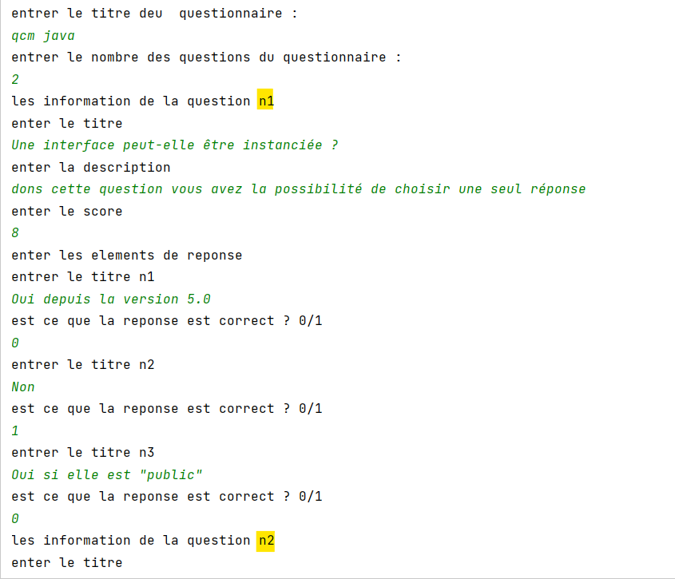
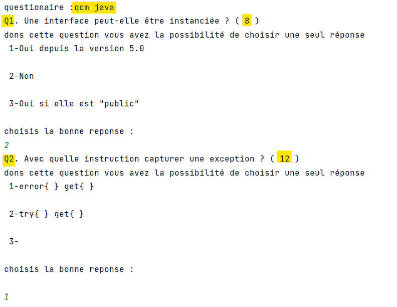
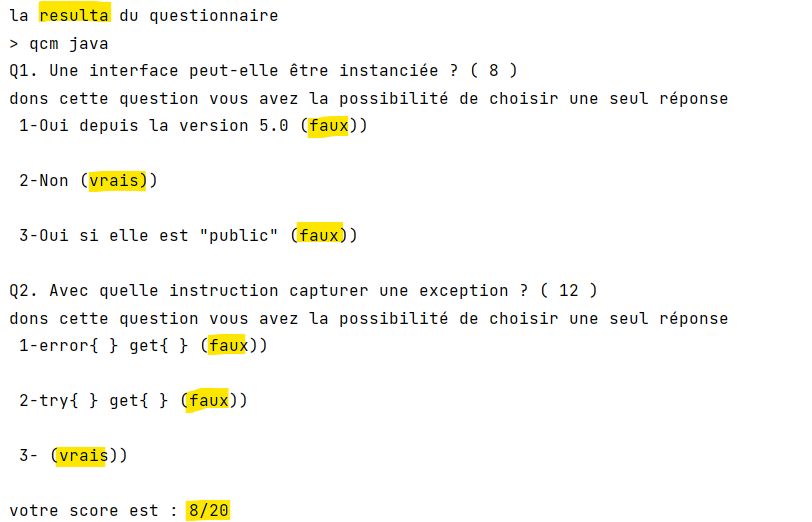

## Questionnaire
> Créer une application qui permet de saisir un questionnaire avec l’ensemble des
questions et les options de réponses. Ensuite vous affichez le questionnaire pour
l’utilisateur pour répondre aux questions et à la fin affichez le score final avec la
correction de chaque question (l’option correcte de chaque question).

## Les Fonctions principaux de lapplication

- [x]  saisir un questionnaire 
- [x]  la devision des deux complex
- [x]  affichez le questionnaire en donnant à l'utilisateur la main pour choisir la réponse
- [x]  affichez la resulta du questionnaire avec la correction
- [x]  affichez le score finale de l'utilisateur 

## L'execution du programme

 <h1 align="center">
   
 

   
  > Remplissage du questionnaire <

</h1>
 <h1 align="center">
   
 
   
   > Deroulement du questionnaire <
</h1>
 <h1 align="center">
   
 

  
 > La resulta du questionnaire <
</h1>
</h1>
