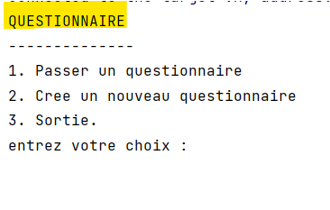

## Questionnaire

> Créer une application qui permet de saisir un questionnaire avec l’ensemble des
> questions et les options de réponses. Ensuite vous affichez le questionnaire pour
> l’utilisateur pour répondre aux questions et à la fin affichez le score final avec la
> correction de chaque question (l’option correcte de chaque question).

## Les Fonctions principaux de lapplication

- [x] la creation d'un nouveau questionnaire avec les reponses
- [x] la consultation du list des questionnaires
- [x] l'ajout d'un questionnaire dons la list des questionnaires
- [x] l'affichage d'un questionnaire en donnant à l'utilisateur la main pour choisir la réponse
- [x] l'affichage du resulta du questionnaire avec la correction de chaque question
- [x] l'affichage du score finale de l'utilisateur

## L'execution du programme

 <h1 align="center">
   

   
  > Menu du questionnaire <

</h1>
 <h1 align="center">
   

   
  > Creation d'un nouveau questionnaire <

</h1>
 <h1 align="center">
   
 
   
   > Deroulement du questionnaire <
</h1>
 <h1 align="center">
   

  
 > La resulta du questionnaire <
</h1>
</h1>
