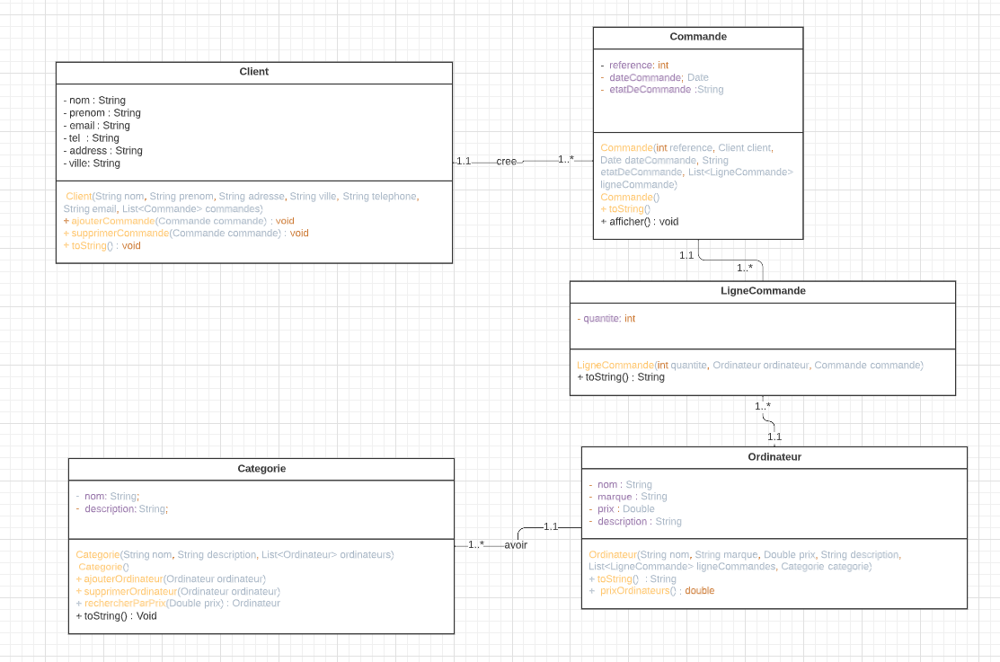
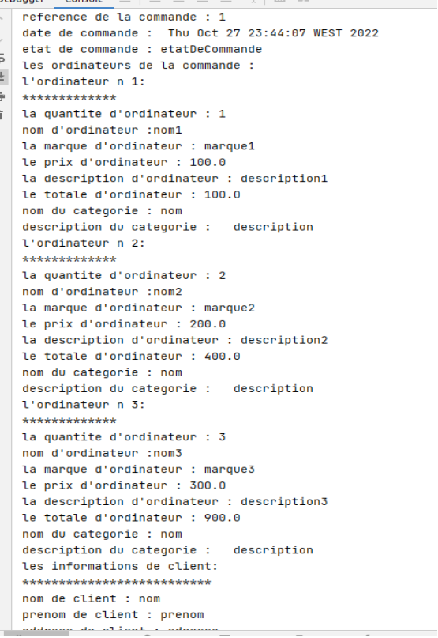

## Gestion des commandes

> L’objectif de cet exercice et de concevoir et de réaliser une application JAVA qui gère les
>commandes des clients d’une entreprise qui vend des ordinateurs. L’application demandée
>doit donner la possibilité de gérer les ordinateurs, les catégories, et les commandes de
>l’entreprise.

## Les Fonctions principaux de l'application

- [x] la creation d'un nouveau cilent 
- [x] déclarez et intentiez une liste de trois ordinateurs ;
- [x] déclarez et intentiez une catégorie ;
- [x] déclarez et intentiez un client ;
- [x] déclarez et instanciez une commande du client ;
- [x] déclarez et instanciez une liste de trois lignes de commandes pour la commande
et les ordinateurs créés ;
- [x] affichez toutes les informations de la commande.

## L’analyse d'application  :

>Premièrement et avant de partir de la partie développement nous schématisons un diagramme de classes afin de mieux comprendre l’aperçu général le schéma de notre >application en modélisant ses classes, ses attributs, ses opérations et les relations entre ses objets. avec l’utilisation de site web lucidchart 

<h1 align="center">
   

   
  > Diagramme du classe <

</h1>

## L'execution du application

 <h1 align="center">
   

   
  > List des Commandes <

</h1>

</h1>
