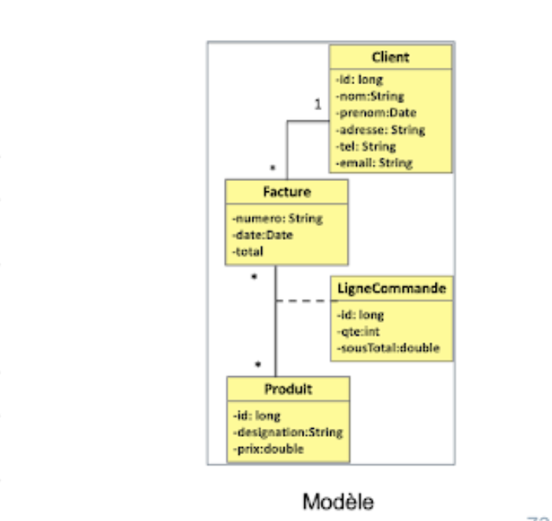
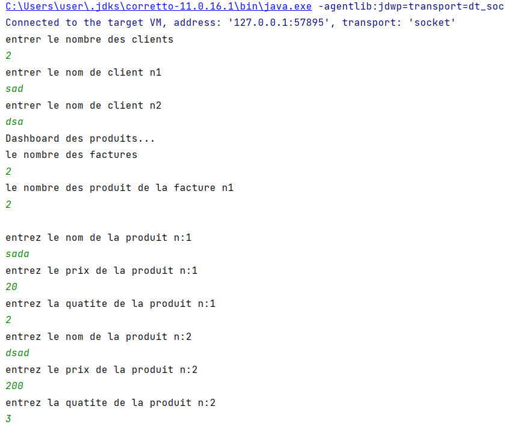
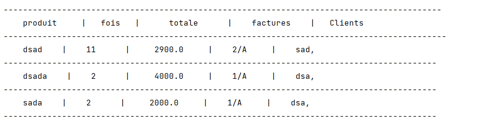

## Gestion de stock

> Créer une application qui permet d'implementer le model ci dessous
> a fin d'afficher les produit commander (gestion de stock)

 <h1 align="center">
   

   
  > Model de class <

</h1>

## Les Fonctions principaux de lapplication

- [x] la creation d'un nouveau client
- [x] la creation d'un nouvelle facture 
- [x] la remplisage de chaque facture par des produits
- [x] la creation des produits
- [x] l'affichage des produits avec tout les informations d'achat concener

## L'execution du programme

</h1>
 <h1 align="center">
   

   
  > La saise des informations <

</h1>
 <h1 align="center">
   
 
   
   > Dashboard <
</h1>
 <h1 align="center">
   
</h1>
